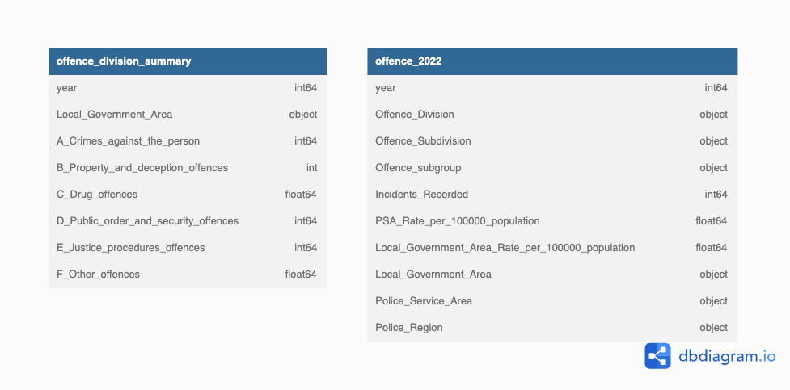
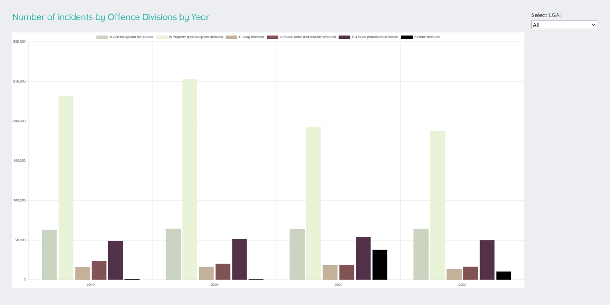
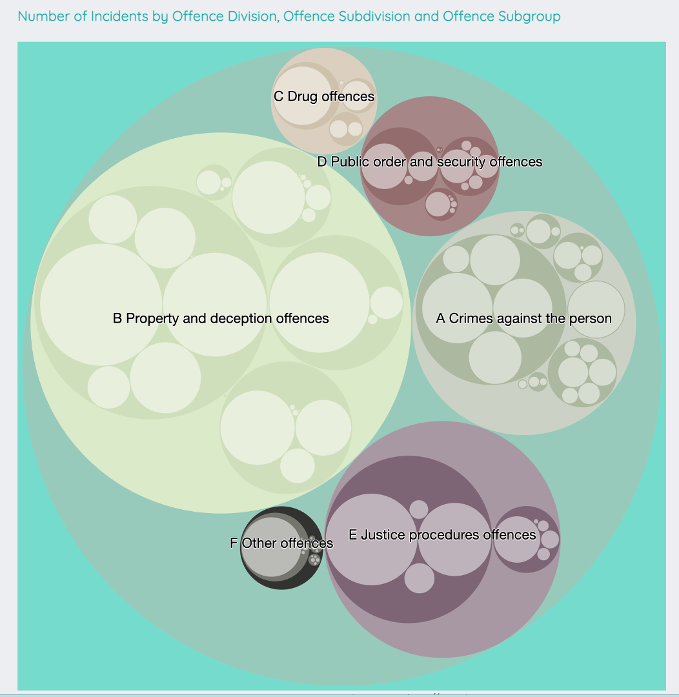

# Project 3 - Crime in Victoria 2019-2022

### Background and Context:

The Victorian Government publishes data in relation to offending types and patterns. It is reported by five geographical levels in Victoria. The data is grouped into 6 separate 'Offence Divisions' with each of these divisions being brokendown into Subdivisions and then further into Subgroups.
                
This topic was chosen for this project for these key reasons:
1. A comprehensive data set that covers 9 years is publicly available.
2. It is also local to Victoria and current (within 6 months); thus has a high level of relevance
3. The data is structured hierarchically with a level of cleaning and manipulation, supporting a layered data visual visualisation.

                

### Challenges and limitations:
1. Data Consistency: The data was organised into multiple tables within multiple workbooks. While initially, the data looked clean and well organised, it rapidly became apparent that each of the workbooks contained data that were derived from different data sources where different filters were applied as there were contradictions in the number of incidents for what appeared to be the same groupings. To overcome this, data was sourced from a single workbook. 

2. Data quality: There were also issues with data quality with extra spaces that impacted data ingestion and additional headings within the rows that resulted in duplication of a number of incidents. This was resolved with dropping of rows and stripping of blanks using the function .str.strip()

3. Data merging: Joining data sets to gain the data required in one data frame resulted in either blank data fields or duplication of rows. This was resolved by using the method that resulted in duplication of rows and applying the .drop_duplicates() function

4. Data quantity limitation in Heroku: Heroku has a limit of 10,000 rows. The original intention had been to compare the number of incidents by offending subcategories by year. However, the data for each year contained just over 5,000 rows (resulting in> 20,000 rows). The design of the data analysis and visualisation was changed to work within this limitation.
   
### Model Design and Delivery

### Step 1: Data Preparation:
1.1. Data retrieved from excel workbook, ingested and converted to CSV files and a list of data frames
1.2. Initial Data cleaning and organization:
   * Select data for 2019-2022 years 
   * Merge police regions and local government areas (LGAs) into one data frame
   * Create data frames 
        * offence_division_summary_df (a summary of Offence Divisions by year, police region and LGA)
        * offence_2019_2022_df (all data for future analysis not loaded into Heroku db)
        * offence_2022_df (full data set for 2022)

### Step 2: Set up and connect to Heroku DataBase

2.1. Connect to, create tables for and load data into Heroku database: offence_division_summary', 'offence_2022' * Note: while some of the field names are identical, there are no relationships between these 2 tables as they view the data from different perspectives, and there are many to-one relationships between like fields.)

## Step 3; Transform Data

3.1. Prepare data for specific visualisations
        * Chart 1: Create JSNON file using 'offence_division_summary' table
        * Chart 2: Create JNSO flare file using 'offence_2022 table

## Step 4; Create charts and web pages 

4.1: index.html: Crime in Victora 2019 - 2022 
 * Chart Title: Number of incidents by Offence Division by Year 
 * Chart Style: chartsjs - Bar Chart  
 * Data source: JSON file created from 'offence_division_summary' data table read directly from the Heroku Data Base
 * Style: d3Style.css, styles.css
 * Code created: in ipynb, mychart.js and index.html 
 * Image of chart: 
 * Image of full html page: [Crime in Victoria 2019-2022](Images/index.html.png)
 * Code created: in ipynb, mychart.js and index.html 

4.2: index html: Offending Patterns 2022 
 * Chart Title: Number of Incidents by Offence Division, Offence Subdivision and Offence Subgroup
 * Chart Style: d3 Observable - stacked circle chart 
 * Data source: JSON file created from 'offence_2022' data table read directly from the Heroku Data Base
 * Style: styles.css
 * Image of chart: 
 * Image of full html page: [Offending Patterns 2022 ](Images/index2022.html.png)
 * Code created: in ipynb, and index2022.html

        
## Step 5; Deploy the Vic_Crime application to Heroku
5.1. Create a Vic_Crime repo on Github for the application
5.2. Preparing the application with additional configuration files (`Procfile` and `requirements.txt`)
 * Create a new conda environment 
 * Install 'gunicorn'
 * install `psycopg2`
 * pip Install flask
 * pip Install flask-sqlalchemy
 * pip Install pandas
 * initialise the database: `initdb.py`
 * make the `run.sh` file executable
 * Navigate to `127.0.0.1:5000` to view your webpage and test out the app before deploying on Heroku. 
 * Use` postgres` and add the app to Heroku.
 * Configuration: `Procfile` - used by Heroku to run the app.
5.3. Creating the Heroku application
* Create a new app in Heroku database
* Deploy the app
5.4  Preparing, adding and initialising the Heroku database
* Create link to Heroku in  Prostfres
* Initialise is the database

### About the Data
Data was sourced from https://www.crimestatistics.vic.gov.au/crime-statistics/latest-crime-data-by-area

### About Circle Packing 
Original concept sourced  from https://observablehq.com/@d3/pack
// Copyright 2021 Observable, Inc.
// Released under the ISC license.
// https://observablehq.com/@d3/pack

### About Heroku Deployment 
© 2021 Trilogy Education Services, LLC, a 2U, Inc. brand. Confidential and Proprietary. All Rights Reserved.